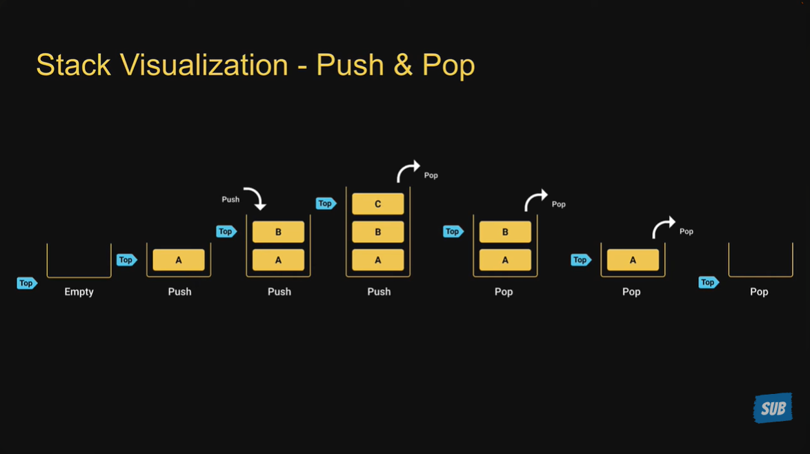
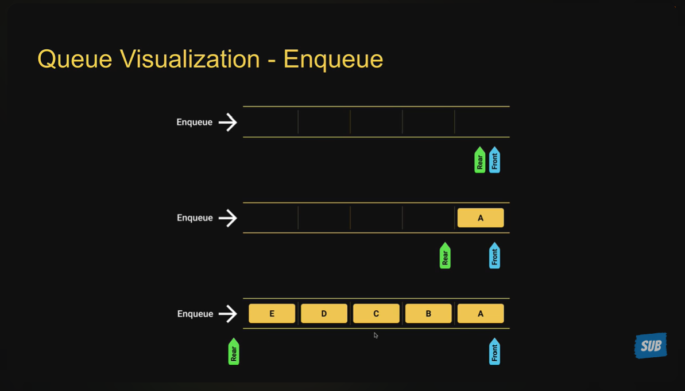
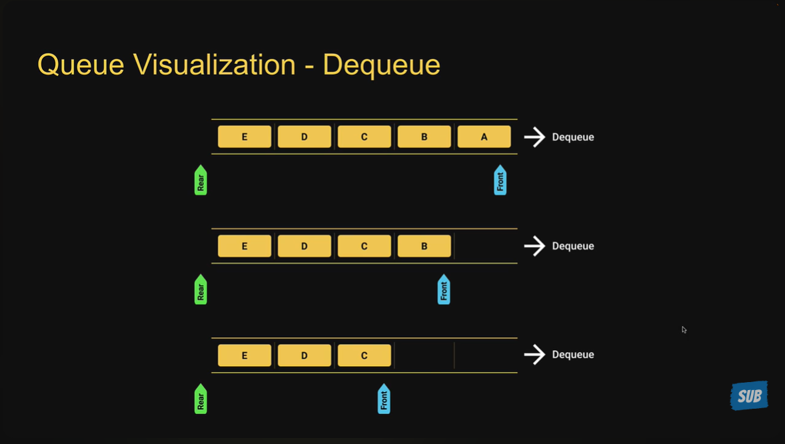
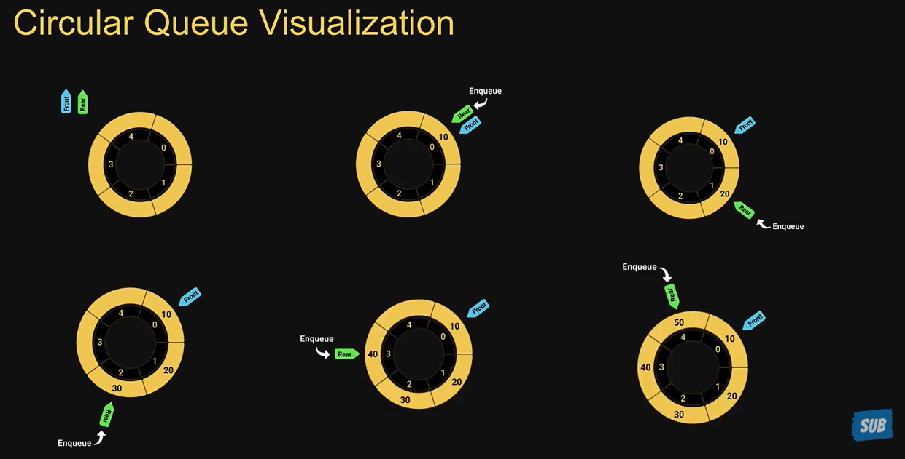
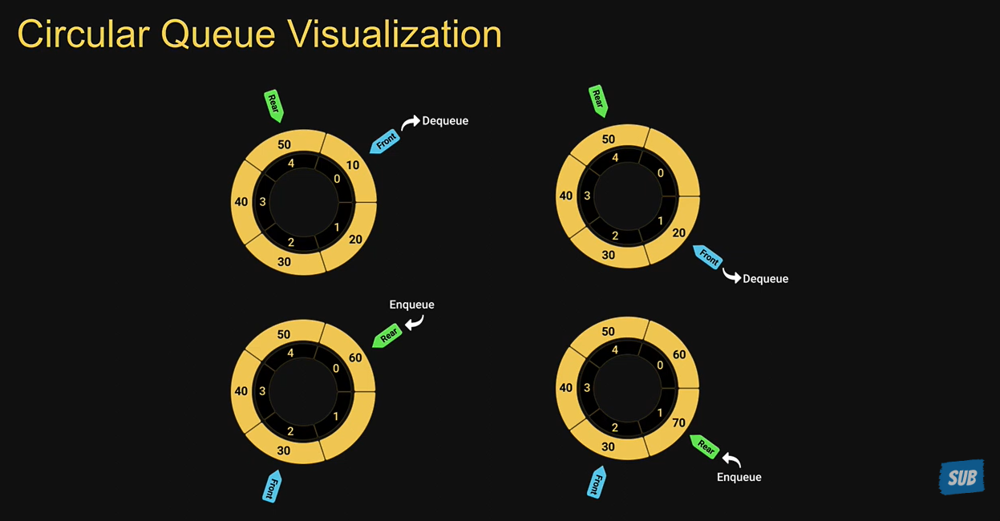

# Data Structures

## Topics

1. [What is a Data Structure?](#1-what-is-a-data-structure)
2. [Why Learn Data Structures?](#2-why-learn-data-structures)
3. [Course Overview](#3-course-overview)
4. [Array](#4-array)
5. [Object](#5-object)
6. [Set](#6-set)
7. [Map](#7-map)
8. [Stack](#8-stack)
9. [Queue](#9-queue)
10. [Circular Queue](#10-circular-queue)
11. [Singly Linked List](#11-singly-linked-list)
12. [Doubly Linked List](#12-doubly-linked-list)
13. [Hash Table](#13-hash-table)
14. [Tree](#14-tree)
15. [Graph](#15-graph)
16. [Priority Queue](#16-priority-queue)
17. [Circular Linked List](#17-circular-linked-list)
18. [Trie](#18-trie-prefix-tree)

---

## 1. What is a Data Structure?

- A data structure is a way to store and organize data so that it can be used efficiently
- A data structure is a collection of data values, the relationships among them, and the functions or operations that can be applied to that data

---

## 2. Why Learn Data Structures?

- Almost every application we build involves data that is modelled in a certain way
- To efficiently manage that data, you need data structures
- Imagine walking into a library only to find out there is no efficient organization of the books and they are stored randomly
- The difference between a function taking a few milliseconds vs a few seconds or even minutes comes down to the selection of the right data structure
- Data structures help you solve problems in a more efficient way, both in terms of time and memory
- Learning about data structures also helps you gain a more profound understanding of things you are already aware of:
  - DOM — tree data structure
  - Browser back and forward — stack data structure
  - OS job scheduling — queue data structure

---

## 3. Course Overview

### Built-in Data Structures

- Arrays
- Objects
- Sets
- Maps

### Custom Data Structures

- Stacks
- Queues
- Circular Queues
- Linked Lists
- Hash Tables
- Trees
- Graphs

---

## 4. Array

- An array is a data structure that can hold a collection of values
- Arrays can contain a mix of different data types — strings, booleans, numbers, or even objects
- Arrays are resizable; you don't have to declare the size before creating one
- JavaScript arrays are zero-indexed and maintain insertion order
- Arrays are iterables and can be used with a `for` loop

### Big-O Time Complexity

| Operation                                          | Complexity |
| -------------------------------------------------- | ---------- |
| Insert / remove at end (`push` / `pop`)            | O(1)       |
| Insert / remove at beginning (`shift` / `unshift`) | O(n)       |
| Insert / remove in middle (`splice`)               | O(n)       |
| Access by index                                    | O(1)       |
| Search for value                                   | O(n)       |
| `concat` / `slice`                                 | O(n)       |
| `forEach` / `map` / `filter` / `reduce`            | O(n)       |

---

## 5. Object

- An object is an unordered collection of key-value pairs
- Keys must be a string or symbol; values can be any data type
- To retrieve a value, use the corresponding key via dot notation (`obj.key`) or bracket notation (`obj["key"]`)
- Objects are not directly iterable — use `Object.keys()`, `Object.values()`, or `Object.entries()` to iterate

### Big-O

| Operation                              | Complexity |
| -------------------------------------- | ---------- |
| Access by key                          | O(1)       |
| Add / remove property                  | O(1)       |
| Search for value                       | O(n)       |
| `Object.keys` / `.values` / `.entries` | O(n)       |

---

## 6. Set

- A set holds a collection of **unique** values
- Can contain a mix of different data types — strings, booleans, numbers, objects
- Dynamically sized; no need to declare size upfront
- Maintains insertion order (iteration visits values in the order they were added)
- Iterable — can be used with a `for...of` loop

### Sets vs Arrays

| Concern          | Set                              | Array                                  |
| ---------------- | -------------------------------- | -------------------------------------- |
| Duplicate values | Not allowed (silently ignored)   | Allowed                                |
| Membership check | O(1) via `.has()`                | O(n) via `.includes()` / `.find()`     |
| Use when         | Uniqueness or fast lookup matter | Order, indexing, or duplicates needed  |

### Time Complexity

| Operation            | Complexity |
| -------------------- | ---------- |
| `add`                | O(1)       |
| `has`                | O(1)       |
| `delete`             | O(1)       |
| Iterate (`for...of`) | O(n)       |

---

## 7. Map

- A map holds key-value pairs where both keys and values can be of any data type
- Maintains insertion order (unlike plain objects, this holds for all key types)
- To retrieve a value, use the corresponding key via `.get(key)`
- Iterable — can be used with a `for...of` loop; exposes `.keys()`, `.values()`, `.entries()`
- Size is always available via the `.size` property

### Maps vs Objects

| Concern          | Map                        | Object                       |
| ---------------- | -------------------------- | ---------------------------- |
| Key types        | Any type                   | String or Symbol             |
| Insertion order  | Always maintained          | Maintained for string keys   |
| Default keys     | None                       | Has prototype keys           |
| Iterable         | `for...of` native          | Via `Object.keys()` etc.     |
| Size             | `.size` property           | `Object.keys().length`       |
| Use when         | Pure data, non-string keys | Structured data with methods |

### Map Big-O

| Operation            | Complexity |
| -------------------- | ---------- |
| `set`                | O(1)       |
| `get`                | O(1)       |
| `has`                | O(1)       |
| `delete`             | O(1)       |
| Iterate (`for...of`) | O(n)       |

---

## 8. Stack

- A stack is a sequential collection of elements that follows the **Last In, First Out (LIFO)** principle
- The last element inserted is the first to be removed — like a stack of plates
- A stack is an abstract data type defined by its behavior, not a mathematical model
- Two core operations:
  - `push` — adds an element to the top
  - `pop` — removes the most recently added element

### Stack Usage

- Browser history tracking
- Undo operation when typing
- Expression conversions
- Call stack in the JavaScript runtime

### Stack Big-O

| Operation            | Complexity |
| -------------------- | ---------- |
| `push`               | O(1)       |
| `pop`                | O(1)       |
| `peek`               | O(1)       |
| `isEmpty`            | O(1)       |
| `size`               | O(1)       |
| `clear`              | O(1)       |
| Iterate (`for...of`) | O(n)       |

---

## 9. Queue

- A queue is a sequential collection of elements that follows the **First In, First Out (FIFO)** principle
- The first element inserted is the first to be removed — like a queue of people
- People enter at one end (rear/tail) and leave from the other end (front/head)
- A queue is an abstract data type defined by its behavior, not a mathematical model
- Two core operations:
  - `enqueue` — adds an element to the rear/tail
  - `dequeue` — removes an element from the front/head

### Queue Usage

- Printers
- CPU task scheduling
- Callback queue in the JavaScript runtime

### Queue Implementation

| Method        | Description                                         |
| ------------- | --------------------------------------------------- |
| `enqueue(el)` | Add an element to the rear of the queue             |
| `dequeue()`   | Remove and return the element at the front          |
| `peek()`      | Return the front element without removing it        |
| `isEmpty()`   | Check if the queue is empty                         |
| `size()`      | Return the number of elements in the queue          |
| `print()`     | Visualize the elements in the queue                 |

### Queue Big-O

| Operation            | Complexity |
| -------------------- | ---------- |
| `enqueue`            | O(1)       |
| `dequeue`            | O(n)       |
| `peek`               | O(1)       |
| `isEmpty`            | O(1)       |
| `size`               | O(1)       |
| Iterate (`for...of`) | O(n)       |

> **Note:** `dequeue` is O(n) when backed by an array because `Array.shift()` re-indexes every remaining element. A linked-list or object-based implementation achieves O(1).

---

## 10. Circular Queue

- A circular queue is a linear data structure that follows the **First In, First Out (FIFO)** principle, but the last position is connected back to the first position to form a circle
- Also referred to as a **circular buffer** or **ring buffer**
- Uses a fixed block of memory — empty slots created by dequeue operations are reused
- When working with queues of a fixed maximum size, a circular queue is the preferred implementation
- Two core operations:
  - `enqueue` — adds an element to the rear/tail
  - `dequeue` — removes an element from the front/head

### Circular Queue Usage

- Clocks
- Streaming data buffers
- Traffic light scheduling

### Circular Queue Implementation

| Method        | Description                                              |
| ------------- | -------------------------------------------------------- |
| `enqueue(el)` | Add an element to the rear of the queue                  |
| `dequeue()`   | Remove and return the element at the front               |
| `peek()`      | Return the front element without removing it             |
| `isFull()`    | Check if the queue has reached capacity                  |
| `isEmpty()`   | Check if the queue is empty                              |
| `size()`      | Return the number of elements currently in the queue     |
| `print()`     | Visualize the elements in the queue (front → rear)       |

### Circular Queue Big-O

| Operation            | Complexity |
| -------------------- | ---------- |
| `enqueue`            | O(1)       |
| `dequeue`            | O(1)       |
| `peek`               | O(1)       |
| `isFull`             | O(1)       |
| `isEmpty`            | O(1)       |
| `size`               | O(1)       |
| Iterate (`for...of`) | O(n)       |

> **Note:** All core operations are O(1) because the circular index trick (`(index + 1) % capacity`) eliminates the need to shift elements, unlike a plain array-backed queue.

---

## 11. Singly Linked List

- A linked list is a linear data structure that consists of a series of connected nodes
- Each node holds a **value** and a **pointer** (`next`) to the next node in the sequence
- Elements can be inserted or removed without reallocating or reorganizing the rest of the structure — unlike an array, nothing needs to shift
- Random access isn't possible; reaching a given element means walking the list from the head, so access is O(n)

### Core Operations

- **Insertion** — add an element at the beginning, end, or a given index
- **Deletion** — remove an item by its index or by its value
- **Search** — find an element given its value

### Traversal (Print)

Walk the list from `head` to `null`, one `next` pointer at a time.

### Prepend

Point the new node's `next` at the current head, then make the new node the head. O(1) — no traversal needed.

### Append

Walk to the last node (the one whose `next` is `null`) and link it to the new node. Without a tail reference this costs O(n); see [Optimization: Tracking a Tail Pointer](#optimization-tracking-a-tail-pointer) below for the O(1) version.

### Insert at a Given Index

Walk to the node just before the target index, then splice the new node in between it and its old `next`.

### Remove

**By value:**

**By index:**

### Search

Walk the list comparing each node's value until a match is found or `null` is reached.

### Reverse

Re-point every node's `next` back at the node before it, tracking `prev`/`curr`/`next` pointers as you go, then make the old tail the new head.

### Using a Linked List as a Stack or Queue

A linked list is the natural backing structure for both a stack and a queue — `prepend`/`removeFrom(0)` give a stack O(1) push/pop at the head, and tracking a tail reference gives a queue O(1) enqueue at the tail alongside O(1) dequeue at the head.

### Optimization: Tracking a Tail Pointer

Keeping a `tail` reference alongside `head` turns `append` (and removing the last node) from an O(n) walk into an O(1) pointer update — at the cost of an extra field to keep in sync on every insertion and removal.

### Singly Linked List Big-O (No Tail Reference)

| Operation | Complexity |
| --- | --- |
| Access by index | O(n) |
| Search for value | O(n) |
| Prepend (`insertAt(0)`) | O(1) |
| Append | O(n) |
| Insert at index | O(n) |
| Remove from head | O(1) |
| Remove by value / index | O(n) |
| Reverse | O(n) |
| Iterate (`for...of`) | O(n) |

> **Note:** Tracking a `tail` reference brings `append` and "remove the last node" down to O(1), since there's no longer a need to walk the whole list to find the last node.

### Linked List Usage

- Every application of a stack or a queue is also an application of a linked list, since both can be implemented on top of one
- Image viewers (each photo links to the next/previous)

---

## 12. Doubly Linked List

- A doubly linked list is the same idea as a singly linked list, except each node also holds a `prev` pointer back to the previous node
- The extra backward link allows traversal in **both directions** and lets a node be removed in O(1) once you're holding it, without needing to walk from the head to find its predecessor
- A `tail` reference is typically kept alongside `head`, making append and "remove from the end" O(1) as well

### Singly vs Doubly Linked List

| Concern | Singly Linked List | Doubly Linked List |
| --- | --- | --- |
| Links per node | 1 (`next`) | 2 (`next` and `prev`) |
| Memory per node | Lower | Higher (extra pointer) |
| Traversal direction | Forward only | Forward and backward |
| Remove tail (with a node ref) | O(n) — must find the `prev` | O(1) — `prev` is already known |
| Remove head | O(1) | O(1) |

### Doubly Linked List Big-O

| Operation | Complexity |
| --- | --- |
| Access by index | O(n) |
| Search for value | O(n) |
| Prepend | O(1) |
| Append (with `tail`) | O(1) |
| Insert at index | O(n) |
| Remove from head | O(1) |
| Remove from tail | O(1) |
| Remove by value / index | O(n) |
| Reverse | O(n) |
| Iterate (`for...of`) | O(n) |

### Doubly Linked List Usage

- Browser history (back **and** forward navigation)
- Undo/redo stacks that need to move in either direction
- LRU cache implementations, where a node needs to jump to the front or be evicted from the back in O(1)

---

## 13. Hash Table

- A hash table, also known as a hash map, is a data structure used to store key-value pairs
- Given a key, you can associate a value with that key for very fast lookup
- JavaScript's `Object` is a special implementation of the hash table data structure — though as a built-in, it carries inherited prototype keys that your own keys may collide with and overwrite
- `Map` (introduced in ES2015) also stores key-value pairs, without the inherited-key collision risk
- Writing a hash table implementation from scratch is a popular JavaScript interview question

### Hash Table Concepts

- Hash tables store key-value pairs, e.g.:
  1. `'in'` → `'india'`
  2. `'au'` → `'australia'`
  3. `'fr'` → `'france'`
  4. `'it'` → `'italy'`
- A plain array-of-buckets hash table gives **no insertion-order guarantee** — iterating (`keys`, `values`, printing all entries) walks buckets by their numeric index, i.e. by hash value, not by the order items were inserted. This differs from JavaScript's own `Map`/`Object`, which do preserve insertion order.

#### Analogy

- Key-value pairs are stored in a fixed-size array
- Arrays only have numeric indices — so how do you go from a string key to a numeric index? A **hashing function**
- A hashing function accepts the string key, converts it into a hash code using a defined logic, then maps it to a numeric index within the bounds of the array
- The value is stored at that index; the same hashing function is reused to retrieve the value given the key

.png>)

.png>)

### Hash Table Implementation

| Method | Description |
| --- | --- |
| `set(key, value)` | Store a key-value pair |
| `get(key)` | Retrieve a value given its key |
| `remove(key)` | Delete a key-value pair given its key |

> **Note:** Different keys can hash to the same index — a **collision**. Each slot in the array is typically its own bucket (array or linked list) of `[key, value]` pairs, rather than a single value, so colliding keys can still coexist.

### Hash Table Usage

- Database indexing
- Caches
- Anywhere constant-time lookup and insertion are required

### Hash Table Big-O

| Operation | Complexity |
| --- | --- |
| `set` | O(1) average, O(n) worst case |
| `get` | O(1) average, O(n) worst case |
| `remove` | O(1) average, O(n) worst case |
| `keys` / `values` | O(n) |

> **Note:** Worst-case O(n) happens when many keys collide into the same bucket. A good hash function (and resizing the table as it fills up) keeps buckets small and lookups close to O(1).

---

## 14. Tree

- A tree is a hierarchical data structure that consists of nodes connected by edges
- Unlike arrays, linked lists, stacks, and queues — all **linear** data structures — a tree is **non-linear**
- In linear data structures, search time is proportional to the size of the data set; a tree's non-linear/branching shape allows faster access to data
- A tree contains no loops or cycles

### Tree Terminology

.png>)

.png>)

.png>)

.png>)

### Tree Usage

- File systems (directory structure)
- Family trees
- Organization charts
- The DOM
- Chatbot decision trees
- Abstract syntax trees (ASTs)

### Binary Tree

- A binary tree is a tree in which each node has **at most two children**, referred to as the **left child** and **right child**

### Binary Search Tree (BST)

- A binary search tree layers an ordering rule on top of a binary tree:
  - Every value in a node's **left** subtree is **smaller** than the node's value
  - Every value in a node's **right** subtree is **greater** than the node's value
  - Each node still has at most two children

#### Insertion

Compare the new value against each node starting at the root, going left when smaller and right when greater, until an empty spot is found.

.png>)

.png>)

.png>)

.png>)

#### BST Search

Starting at the root, go left or right depending on whether the target is smaller or larger than the current node, until it's found or a `null` child is reached.

#### Min / Max

Because of the ordering rule, the minimum value is always the leftmost node and the maximum value is always the rightmost node.

#### Removal

Removing a node has three cases, depending on how many children it has:

### Binary Search Tree Operations

| Method | Description |
| --- | --- |
| `insert(value)` | Add a node to the tree |
| `search(value)` | Find whether a node with the given value exists |
| `remove(value)` | Remove a node given its value |
| DFS / BFS | Visit every node in the tree |

### Binary Search Tree Usage

- Searching
- Sorting
- Implementing abstract data types such as lookup tables and priority queues

### Binary Search Tree Big-O

| Operation | Average | Worst Case (unbalanced) |
| --- | --- | --- |
| `insert` | O(log n) | O(n) |
| `search` | O(log n) | O(n) |
| `remove` | O(log n) | O(n) |
| Traversal (DFS/BFS) | O(n) | O(n) |

> **Note:** Worst case degrades to O(n) when the tree is unbalanced — e.g. inserting values in sorted order produces a tree that's really just a linked list. Self-balancing trees (AVL, Red-Black) guarantee O(log n).

### Tree Traversal

Visiting every node in a tree can be done in different ways:

- **Depth-First Search (DFS)** — go as far as possible down one branch before backtracking
- **Breadth-First Search (BFS)** — visit every node at the current depth before moving to the next depth level

#### Depth-First Search (DFS)

DFS starts at the root and explores as far as possible along each branch before backtracking: visit the root, then the entire left subtree, then the entire right subtree. The order in which the root is visited relative to its subtrees gives three traversal types:

| Traversal | Order |
| --- | --- |
| Preorder | Root → Left → Right |
| Inorder | Left → Root → Right |
| Postorder | Left → Right → Root |

> **Tip:** Inorder traversal of a BST visits nodes in ascending sorted order — a handy way to "flatten" a BST back into a sorted list.

#### Breadth-First Search (BFS)

BFS explores all nodes at the current depth before moving to the next depth level, using a queue:

1. Enqueue the root node
2. While the queue isn't empty:
   - Dequeue the node at the front
   - Read the node's value
   - Enqueue its left child, if it exists
   - Enqueue its right child, if it exists

### Tree Traversal Big-O

| Operation | Complexity |
| --- | --- |
| DFS (preorder / inorder / postorder) | O(n) |
| BFS | O(n) |
| Space (DFS, recursive) | O(h) — h = tree height, O(log n) balanced / O(n) worst case |
| Space (BFS, queue) | O(w) — w = max tree width, up to O(n) |

---

## 15. Graph

- A graph is a non-linear data structure consisting of a finite number of **vertices** (nodes) connected by **edges**
- A tree is actually a specific, restricted type of graph (connected, acyclic, with a single root)

### Types of Graph

#### Directed Graph

- A graph in which edges have a **direction** — they go from one vertex to another, not both ways
- Edges are drawn as arrows pointing in the direction the graph can be traversed

#### Undirected Graph

- A graph in which edges are **bidirectional** — the graph can be traversed in either direction along an edge
- The absence of an arrow signals an undirected graph

### Graph Representation

- **Adjacency matrix** — a 2D array of size V × V (V = number of vertices). Each row/column represents a vertex; `matrix[i][j] === 1` means an edge connects vertex `i` and vertex `j`

- **Adjacency list** — vertices are stored in a map-like structure, and every vertex stores a list of its adjacent vertices

### Adjacency Matrix vs Adjacency List

| Concern | Adjacency List | Adjacency Matrix |
| --- | --- | --- |
| Storage | Only stores edges that exist — more space-efficient | Stores a value for every possible vertex pair, regardless of whether an edge exists |
| Insert / find adjacent vertices | O(1) | O(V) |
| Storing extra edge data (e.g. weight) | Natural — attach it alongside the neighbor | Needs external storage |

### Graph Usage

- Google Maps / routing and navigation
- Social media sites (friend/follow networks)

### Graph Operations

| Method | Description |
| --- | --- |
| `addVertex(vertex)` | Add a vertex to the graph |
| `addEdge(v1, v2)` | Connect two vertices with an edge |
| `removeEdge(v1, v2)` | Remove the edge between two vertices |
| `removeVertex(vertex)` | Remove a vertex and all edges connected to it |
| `hasEdge(v1, v2)` | Check whether an edge exists between two vertices |
| DFS / BFS | Visit every reachable vertex from a starting vertex |

### Graph Big-O (Adjacency List)

| Operation | Complexity |
| --- | --- |
| `addVertex` | O(1) |
| `addEdge` | O(1) |
| `removeEdge` | O(E) — E = edges on the vertex, to filter it out |
| `removeVertex` | O(V + E) |
| `hasEdge` | O(E) — E = edges on the vertex |
| DFS / BFS | O(V + E) |

> **Note:** With an adjacency matrix, `hasEdge` drops to O(1) but `addVertex` becomes O(V²) (the matrix must grow by a row and column), and traversal costs O(V²) instead of O(V + E) since every cell must be checked even where no edge exists.

---

## 16. Priority Queue

- A priority queue is a data structure where each element carries a **priority**, and elements are served by priority rather than by insertion order (unlike a plain queue's strict FIFO behavior)
- A **min** priority queue always serves the lowest priority value first; a **max** priority queue always serves the highest first
- Typically implemented with a **binary heap** for O(log n) insertion/removal, rather than a sorted array (O(n log n) to keep sorted) or an unsorted array (O(n) scan to find the minimum/maximum each time)

### Binary Heap

- A complete binary tree (every level full except possibly the last, filled left to right) stored in a flat array
- For a node at index `i`: its children live at `2i + 1` and `2i + 2`, and its parent lives at `floor((i - 1) / 2)`
- **Heap property (min-heap):** every parent's priority is ≤ both of its children's priorities — this does *not* mean the array is fully sorted, only that the root is always the minimum
- After every insertion or removal, the changed element is "bubbled" up or down until the heap property is restored

### Priority Queue Operations

| Method | Description |
| --- | --- |
| `enqueue(value, priority)` | Add a value with a given priority, then bubble it up to restore the heap property |
| `dequeue()` | Remove and return the highest-priority element, then bubble the replacement down |
| `peek()` | Return the highest-priority element without removing it |
| `isEmpty()` | Check if the priority queue is empty |
| `size()` | Return the number of elements |

### Priority Queue Usage

- Dijkstra's and Prim's algorithms (always process the closest/cheapest unvisited node next)
- CPU task scheduling (higher-priority processes run first)
- Hospital ER triage, print job queues — any "most urgent first" ordering

### Priority Queue Big-O

| Operation | Complexity |
| --- | --- |
| `enqueue` | O(log n) |
| `dequeue` | O(log n) |
| `peek` | O(1) |
| `isEmpty` / `size` | O(1) |

> **Note:** `algorithms/concepts/dijkstra.js` uses a minimal sorted-array priority queue instead of a binary heap — fine for a short demo, but it makes `enqueue` O(n log n) instead of O(log n). The binary-heap version here is the one to reach for outside of a small teaching example.

---

## 17. Circular Linked List

- A circular linked list is a variation of a linked list where the **last node's `next` points back to the first node (`head`)** instead of `null`, forming a loop
- There is no natural "end" to stop a naive traversal at — every traversal must count up to the list's known `size` (or stop upon returning to `head`) rather than checking for `next === null`, which would never happen and would loop forever
- Core operations mirror a singly linked list (insertion, deletion, traversal, searching), but insertion/removal at either end must also keep the tail's `next` pointer correctly wrapped back to the head

### Circular Linked List Operations

| Method | Description |
| --- | --- |
| `append(value)` | Add a node to the end, closing the loop back to `head` |
| `prepend(value)` | Add a node to the beginning, re-linking `tail.next` to the new `head` |
| `remove(value)` | Delete the first node matching a value (handles head, tail, middle, and single-node cases) |
| `search(value)` | Check whether a value exists, bounded to `size` steps |
| `toArray()` | Return the list's values as a plain array |

### Circular Linked List Usage

- Round-robin CPU scheduling (cycle through processes indefinitely)
- Repeating/looping playlists or carousels
- Multiplayer turn order (cycle back to the first player after the last)

### Circular Linked List Big-O

| Operation | Complexity |
| --- | --- |
| Append (with `tail` reference) | O(1) |
| Prepend | O(1) |
| Remove from head | O(1) |
| Remove from tail / by value | O(n) — must walk to the node before the target |
| Search | O(n) |
| Traverse (bounded by `size`) | O(n) |

> **Note:** Without a tracked `size`, a bug in a circular list is much easier to trigger than in a regular linked list — any traversal that checks for `next === null` as its stop condition will spin forever, since that condition never occurs.

---

## 18. Trie (Prefix Tree)

- A trie is a tree-shaped data structure specialized for storing strings, where each **edge represents a single character**, and words sharing a common prefix share the same path down from the root
- This makes prefix-based lookups (autocomplete, spell-check, IP routing tables) far more efficient than scanning a list of strings one at a time
- Each node marks whether a word actually **ends** there (`isEndOfWord`) — this distinguishes a stored word like `"car"` from `"car"` merely being a prefix of another stored word like `"card"`

### Trie Operations

| Method | Description |
| --- | --- |
| `insert(word)` | Add a word, one character at a time, creating nodes for any that don't already exist |
| `search(word)` | Check whether an exact word exists |
| `startsWith(prefix)` | Check whether any stored word begins with the given prefix |
| `getWordsWithPrefix(prefix)` | Return every stored word beginning with the given prefix (autocomplete) |
| `delete(word)` | Remove a word, pruning nodes left with no children and no other word ending there |

> **Note:** Deleting from a trie is easy to get subtly wrong — a node can only be pruned if it has no children *and* isn't the end of some other word. Naively deleting nodes without checking both conditions can corrupt sibling words that share the deleted word's prefix (e.g. deleting `"car"` must not affect `"card"` or `"care"`).

### Trie Usage

- Autocomplete and typeahead search
- Spell checkers (fast "does this prefix lead anywhere" checks)
- IP routing tables (longest-prefix matching)
- Dictionary / word-game implementations (e.g. Boggle, Scrabble validity checks)

### Trie Big-O

| Operation | Complexity |
| --- | --- |
| `insert` | O(k) — k = length of the word |
| `search` | O(k) |
| `startsWith` | O(k) |
| `delete` | O(k) |
| `getWordsWithPrefix` | O(k + m) — k to find the prefix node, m = total characters across all matching words |

> **Note:** A trie trades memory for speed — storing n words of average length k can require up to O(n × k) nodes in the worst case (no shared prefixes), compared to a hash set's O(n) entries. The payoff is that trie lookups depend only on word length, not on how many words are stored.

---

### Next Steps

Topics not yet covered in this document:

- Self-balancing binary search trees: AVL trees and Red-Black trees
- Directed Acyclic Graphs (DAGs) — cycle detection and topological sort on top of the existing `Graph` class
- Minimum-spanning-tree and shortest-path graph algorithms: Prim's, Kruskal's, and Floyd-Warshall (`Dijkstra's` is already covered in `algorithms/concepts/dijkstra.js`)
- Solve more problems that put these data structures to use
